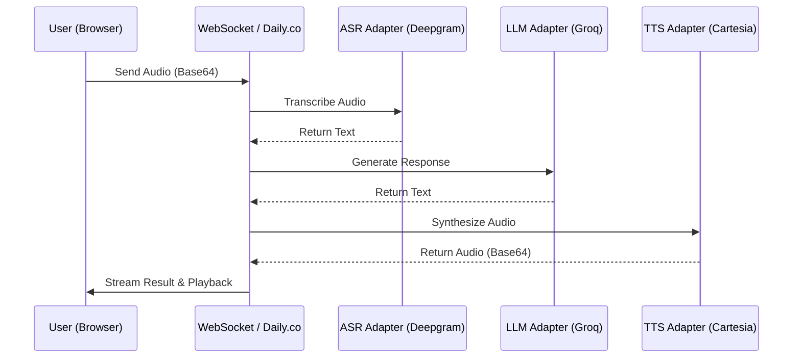

# Voice Agent Starter Kit - Architecture

This repository is a starter kit for building real-time, low-latency voice agents. It provides a modular framework for handling audio transport, speech processing, and LLM-driven interaction.

## Overview

The kit enables a full voice-to-voice interaction loop:
1. **Audio Capture**: Captures user audio via WebRTC (Daily.co) or a direct WebSocket connection.
2. **ASR (Automated Speech Recognition)**: Converts audio to text using high-performance providers like Deepgram.
3. **LLM (Large Language Model)**: Generates intelligent responses using fast inference engines like Groq.
4. **TTS (Text-to-Speech)**: Converts assistant text back to natural-sounding audio using providers like Cartesia.
5. **Transport**: Delivers the audio back to the user with minimal latency.

## System Architecture

### 1. Backend Layer (FastAPI)
The backend is built with FastAPI and serves as the orchestrator for the entire system.
- **Main Entry Point (`app/main.py`)**: Defines REST endpoints for health checks, telemetry, and Daily.co token generation. It also hosts the primary WebSocket gateway.
- **WebSocket Gateway (`/ws/audio-pipeline`)**: Manages real-time bidirectional communication. It receives audio payloads (Base64/WebM) and streams back processed results.
- **Configuration (`app/config.py`)**: Uses Pydantic-style settings to manage API keys and model parameters for all integrated services.

### 2. Audio Pipeline (`app/pipeline/`)
The core logic resides in a modular pipeline service that serializes the interaction:
- **`AudioPipelineService`**: A service class that coordinates the flow from ASR -> LLM -> TTS.
- **Adapters (`app/pipeline/adapters.py`)**: Standardized interfaces for external APIs:
    - **ASR**: Deepgram (`nova-3`) - Chosen for its sub-second transcription latency.
    - **LLM**: Groq (`llama-3.1-8b-instant`) - Leverages LPU technology for near-instant text generation.
    - **TTS**: Cartesia (`sonic-3`) - Optimized for low-latency streaming audio synthesis.

### 3. Transport Layer (`app/transport/`)
Handles the connectivity between the agent and the user.
- **Daily.co Integration (`app/transport/daily.py`)**: Provides WebRTC transport. This allows the agent to join "rooms" where multiple users can interact with it via browser-native audio/video.
- **WebSocket Transport**: For simple, direct integrations without the overhead of WebRTC.

### 4. Telemetry and Observability (`app/telemetry.py`)
- **Latency Tracking**: Automatically measures time spent in each pipeline stage (ASR, LLM, TTS) and total round-trip time.
- **Stat Store**: Keeps an in-memory rolling window of metrics to provide P95 and average latency summaries via an API endpoint.

### 5. Frontend (`static/`)
- **Demo Client**: A vanilla JavaScript interface that demonstrates how to:
    - Join a Daily.co room.
    - Handle local microphone capture.
    - Implement **VAD (Voice Activity Detection)** on the client side to automatically trigger processing after a user stops speaking.
    - Handle base64 audio playback.

## Data Flow

## Setup and Use
1. **Requirements**: Python 3.10+, Deepgram/Groq/Cartesia/Daily API keys.
2. **Installation**: `pip install -r requirements.txt`.
3. **Configuration**: Copy `.env.example` to `.env` and fill in your keys.
4. **Execution**: `uvicorn app.main:app --reload`.
